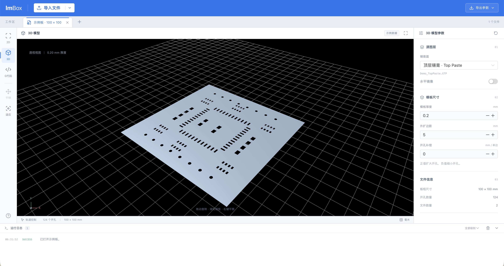
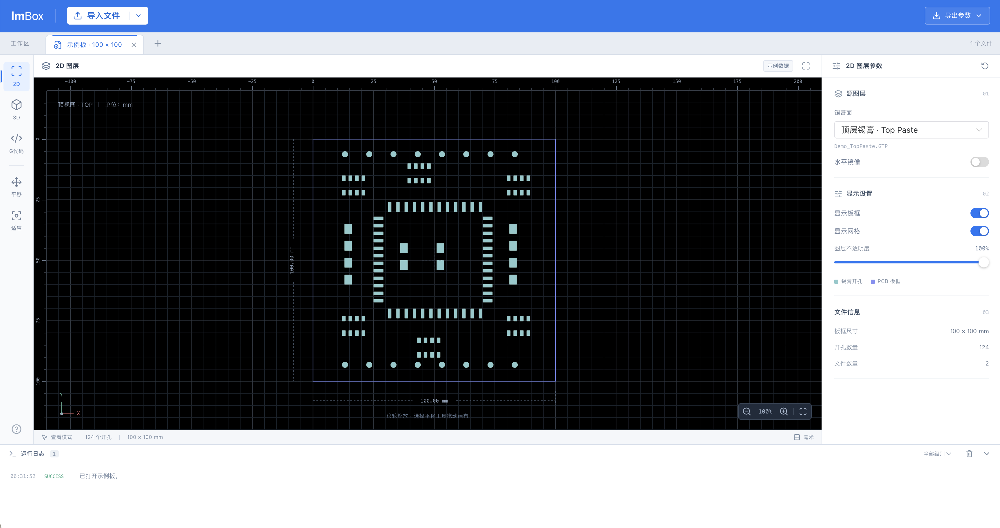
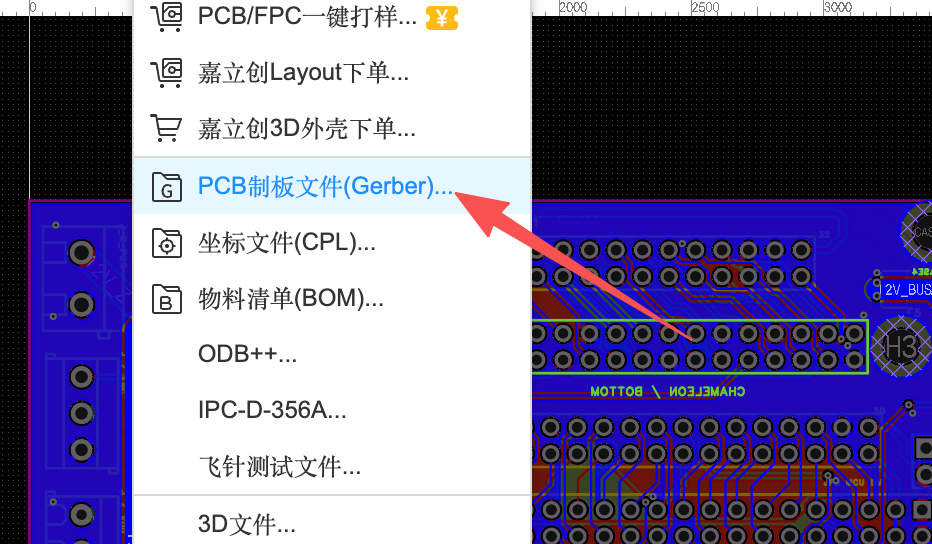

<h1 align="center">
  
  <picture>
    <source media="(prefers-color-scheme: dark)" srcset="docs/images/lmbox-wordmark-dark.svg">
    
  </picture>
</h1>

<p align="center">
  <a href="README.md">English</a> · <strong>한국어</strong> · <a href="README.zh-CN.md">中文</a>
</p>

<p align="center">Gerber 파일 하나로, 한 번에 3D 프린팅용 스텐실까지.</p>

<p align="center">
  <a href="package.json"></a>
  <a href="LICENSE"></a>
  <a href="https://lavamilk.club"></a>
</p>

<p align="center"><sub>자체 소스 공개 라이선스를 사용합니다. 상업적 이용은 금지되며, 파생물을 배포하거나 네트워크 서비스로 제공할 경우 동일한 라이선스로 소스 코드를 공개해야 합니다.<br>사용 전에 <a href="LICENSE">LICENSE</a>를 읽고 조건을 확인하여 라이선스 관련 위험을 피하세요. 중국어 원문이 공식 라이선스입니다.</sub></p>

<p align="center"></p>

<p align="center"><strong>3D 스텐실 모델 · STEP 내보내기 예정</strong><br><sub>예제 데이터로 만든 모델 미리보기입니다. STEP 파일 생성은 아직 구현되지 않았습니다.</sub></p>

<p align="center"></p>

<p align="center"><strong>솔더 페이스트 레이어 미리보기</strong><br><sub>예제 Top Paste 레이어의 개구부를 표시합니다. 가져온 Gerber 파일의 형상 파싱은 구현 예정입니다.</sub></p>

<p align="center"></p>

<p align="center"><strong>Gerber로 시작하는 스텐실 제작</strong><br><sub>PCB 편집기에서 Gerber 파일을 내보내세요. 한 번의 클릭으로 3D 프린팅용 스텐실 파일을 만드는 것이 목표이며, 슬라이싱과 G-code 내보내기도 추가할 예정입니다.</sub></p>

## 아키텍처

기능별로 구성된 모듈형 모놀리스입니다. Vue 프런트엔드는 구현되어 있으며, Rust/Python 백엔드와 슬라이서 연동은 구현 예정입니다.

```text
Vue → Rust → Python 기하 연산
           → 슬라이서 → G-code
```

| 구성 요소 | 역할 | 문서 |
| --- | --- | --- |
| Vue | Feature-first UI, 문서 상태, 2D·3D·경로 미리보기 | [프런트엔드](src/AGENTS.md) |
| Rust / Tauri | 가져오기, Gerber/DXF 파싱, 프로젝트·작업·프로세스 관리 및 내보내기 | [백엔드](src-tauri/AGENTS.md) |
| Python | 기하 연산, 윤곽 처리, 스텐실 모델 생성 및 형상 검사 | [기하 엔진](engine/AGENTS.md) |
| 슬라이서 | Rust의 호출에 따라 슬라이싱 및 G-code 생성 | [슬라이서 연동](src-tauri/AGENTS.md#工程任务与产物) |
| contracts | 버전별 데이터·명령·이벤트·산출물 형식 규약 | [언어 간 규약](contracts/AGENTS.md) |

[프로젝트 작업 규칙](AGENTS.md)
